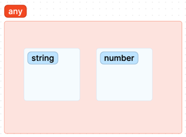
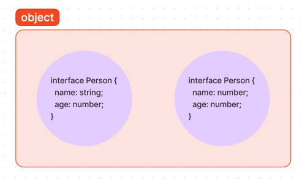

# 타입 단언

## 타입 단언이란? 

변수 선언 후 문자열을 할당하면 타입 추론이 일어난다. 

```ts
let myName = '종현'; // string
```

**as** 키워드를 통해 타입을 단언할 수 있다. 이는 타입스크립트의 타입 추론을 무시하고, 컴파일러에 해당 값의 타입은 검사하지 않는다.

```ts
let myName = '종현' as string; // string
```

```ts
interface Person {
    name: string;
    age: number;
}

const me = {};
me.name = '형주';
me.age = 31;
```

이 경우 타입 에러가 발생하게 된다. 빈 객체(`{}`)는 `Person` 타입을 충족하지 못하기 때문이다.

이 문제는 타입 단언 없이도 해결할 수 있다.
```ts
const me = {
    name: '형주',
    age: 31;
}

// OR

const me: Person  = {
    name: '형주',
    age: 31;
}
```

하지만 타입 구조가 복잡하거나, 다른 누군가가 만들어놓은 서비스를 타입스크립트로 변경 시 에러가 발생할 수 있다. 이 경우 타입 단언을 통해 세부 코드를 변경하지 않고 문제를 해결할 수 있다.

```ts
const me = {} as Person;
me.name = '형주';
me.age = 31;
```

## 타입 단언 문법

### 타입 단언의 대상

> 숫자, 문자열, 객체 등 원시 값 뿐만 아니라 변수나 함수의 호출 결과에서도 사용할 수 있다.

```ts
function getId(id) {
    return id;
}

const result = getId(12) as number;
```

함수의 파라미터 타입을 지정하지 않아 함수의 반환 타입은 `any`가 될테지만, 타입 단언을 통해 `number` 타입으로 추론했다.

### 타입 단언 중첩

여러번 중첩 해서 사용할 수 있다. 이는 앞부터 순차적으로 수행된다.

```ts
const result = 10 as any as number;
// const result = (10 as any) as number;
```

### 타입 단언을 사용할 때 주의할 점

**1. as 키워드는 구문 오른쪽(표현식)에서만 사용한다.**

변수 이름에 사용할 수 없다.

```ts
const num as number = 10;
```

**2. 호환되지 않는 데이터 타입으로는 단언할 수 없다.**

타입 단언이 만능처럼 보일 수 있지만, 실제로는 그렇지 않다. 다음과 같이 작성하면 타입 에러가 발생한다.

```ts
interface Person { 
    name: string;
    age: number;
}

const result = {
    name: 10,
    age: 10,
} as Person;
```

여기서 `string` 타입은 `number` 타입으로 추론될 수 없음을 뜻한다.



위와 같이 타입을 집합 개념으로 생각하면, 겹치는 부분이 없기 때문에 타입단언을 사용할 수 없다.



위 예시에서도 object 타입일 때는 타입 단언을 사용할 수 있었지만, 정확한 타입이 추론되는 순간 타입 단언에서 에러가 발생한다.

**3. 타입 단언 남용하지 않기**

타입 단언은 코드 실행 시점에서 아무런 역할도 해주지 않기 때문에 에러에 취약하다.

```ts
interface Profile {
    name: string;
    id: string;
}

function getProfile() {
    // ...
}

const myProfile = getProfile() as Profile;
renderId(myProfile.id);
```
`myProfile` 변수는 `Profile` 타입으로 추론되어 `id` 프로퍼티가 존재하는 것처럼 수행되지만, 실제로는 함수에서 어떤 값을 내려주는지 알지 못하기 때문에 (any) 에러가 발생할 수 있다.

## null 아님 보장 연산자: **!**

null 타입을 체크할 때 유용하게 쓰는 연산자다.

```js
function shuffleBooks(books) {
    if (books === null || books === undefined) {
        return;
    }
    
    const result = books.shuffle();
    return reuslt;
}
```

`books` 파라미터가 `null`이거나, `undefined` 라면 함수의 로직을 실행하지 않을 수 있다.

여기 타입을 지정해보자.

```ts
interface Books {
    shuffle: Function
}
function shuffleBooks(books: Books) {
    const result = books.shuffle();
    return reuslt;
}
```

여기서 `books`에 null이나 undefined가 들어올 수 있으므로 유니온 타입과 옵셔널 타입을 통해 타입을 수정했다.
```ts
interface Books {
    shuffle: Function
}

function shuffleBooks(books?: Books | undefined) {
    const result = books.shuffle();
    return reuslt;
}
```

이 경우 `books` 타입에서 shuffle 함수가 없을 수 있어 에러가 나타나게되는데, 자바스크립트에서 작성했던 타입 가드를 작성하면 에러를 해결 할 수 있다.

```ts
interface Books {
    shuffle: Function
}

function shuffleBooks(books?: Books | undefined) {
    if (books === null || books === undefined) {
        return;
    }
    
    const result = books.shuffle();
    return reuslt;
}
```

타입스크립트의 타입 체크 레벨을 엄격(strict) 모드로 바꾸면 많은 웹 API가 null을 반환하기 때문에, 매번 처리해주는게 귀찮을 수 있다.

만약 null 체크 로직을 넣는 것이 번거롭고 값이 `null`이 아니라는 확신이 있다면 **null 아님 보장 연산자(!)**를 사용한다.
```ts
function shuffleBooks(books?: Books | undefined) {
    return reuslt;
    const result = books!.shuffle();
}
```

이는 편리하기는 하나 실행 시점의 에러는 막아주지 못하므로 타입 단언보다 타입 추론에 의지하는 것이 좋다.
