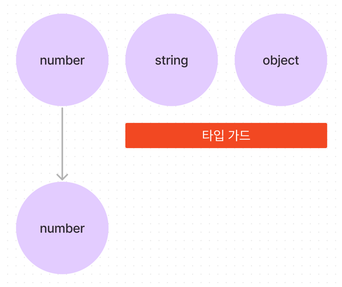
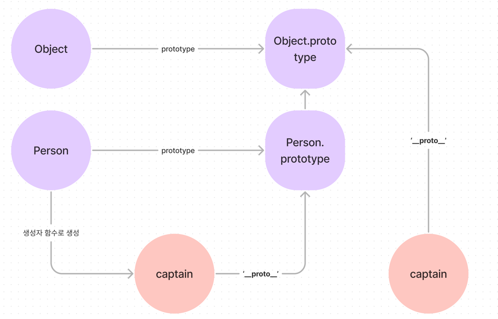

# 타입 가드

## 타입 가드란?

> 여러 개의 타입으로 지정된 값을 특정 위치에서 원하는 타입으로 구분하는 것

타입 시스템 관점에서는 넓은 타입에서 좁은 타입으로 타입 범위를 좁힌다는 의미로 볼 수 있다.




```ts
function updateInput(textInput: number | string | boolean) {
    if (typeof textInput === 'number') {
        textInput // number;
        // .toFixed / .toPrecision
    }
}
```

## 왜 타입 가드가 필요한가?

```ts
function updateInput(textInput: number | string | boolean) {
    textInput.toFixed()
    //        ~~~~~~~ 에러가 발생
}
```

타입가드가 없다면, 유니언 타입 모든 타입에서 `toFixed`가 존재하지 않으므로, 에러가 발생한다.

아래서 타입가드로 사용하는 문법을 알아보자.

### 타입 단언으로 타입 에러 해결하기

```ts
function updateInput(textInput: number | string | boolean) {
    (textInput as number).toFixed()
}
```

타입 단언을 사용하면 쉽게 해결할 수 있지만 문제가 있다.

- 실행 시점의 에러는 막을 수 없다.(string | boolean 타입이 들어올 때)
- 타입 단언을 계속해서 사용해야 한다.

### 타입 단언으로 해결했을 때 문제점

`string | boolean`값은 `toFixed` 내장 함수가 없기 때문에, 해당 값을 건네면 에러가 나오게 된다.

```ts
updateInput('input'); // error
updateInput(false); // error
```

또한 사용하고자 하는 빈도가 많을 수록 매번 타입단언을 하거나 새로운 변수를 만들어야 하기 때문에 쉽게 사용하고자 한 타입 단언이 번거로워지는 역효과가 일어나게 된다.

```ts
function updateInput(textInput: number | string | boolean) {
    (textInput as number).toFixed()
    (textInput as number).toPrecision()
}
```

### 타입 가드로 문제점 해결하기

함수 안에서 타입별로 나누어 로직을 작성할 수 있다.

```ts
function updateInput(textInput: number | string | boolean) {
    if (typeof textInput === 'number') {
        textInput.toFixed(2);
        return;
    }
    
    if (typeof textInput === 'string') {
        console.log(textInput.length);
        return;
    }
}
```

## 타입 가드 문법

### typeof 연산자

자바스크립트에서 사용하는 연산자다. 특정 코드의 타입을 문자열 값으로 반환해 준다.

```ts
typeof 10; // number;
typeof 'hello'; // string;
typeof function() {}; // function
typeof {}; // object
```

`if` 절 내부에서 타입가드를 수행하는 역할이 바로 `typeof` 연산자다.

이를 사용해 원하는 위치에서 원시 타입의 타입추론을 할 수 있다.

### instanceof 연산자

자바스크립트에서 사용하는 연산자다. 변수가 대상 객체의 프로토타입 체인에 포함되는지 확인해 true/false를 반환한다.

```ts
function Person(name, age) {
    this.name = name;
    this.age = age;
}

const captain = new Person('capt', 31);

captain instanceof Person; // true
captain instanceof Object; // true

const hulk = {
    name: hello,
    age: 1,
}
hulk instanceof Person; // false
hulk instanceof Object; // true
```



모든 객체는 기본적으로 `Object.prototype`을 프로토타입으로 상속받는다. 하지만 생성자함수를 거치지 않았다면, Person 프로토타입은 상속받지 못한다.

이러한 형질을 사용해 `instanceof` 연산자를 활용해 타입 가드를 할 수 있다.

```ts
function fetchInfoByProfile(profile: Person | string) {
    if (profile instanceof Person) {
        return `${profile.name}, ${profile.age}`
    } else {
        return profile;    
    }
}
```

### in 연산자

자바스크립트 내장 연산자다. 객체에 특정 프로퍼티 키가 있다면 `true`를 없다면 `false`를 반환한다.

```ts
const book = {
    name: 'jong',
    rank: 1,
}

console.log('name' in book); // true
```

```ts
interface Book {
    name: string;
    rank: number;
}

interface OnlineLecture {
    name: string;
    url: string;
}

function learnCourese(material: Book | OnlineLecture | string) {
    if ('url' in material) {
        // 이 블록 안에서는 material 타입은 OnlineLecture 다.
    }

    if ('name' in material) {
        // 이 블록 안에서는 material 타입은 Book | OnlineLecture 다.
    }
}
```

`in` 연산자를 활용하면 위와 같이 조건을 만족하는 모든 타입을 걸러 낼 수 있다.

## 타입 가드 함수

> 타입 가드 역할을 하는 함수

주로 객체 유니언 타입 중 하나를 구분하는데 사용한다.

```ts
function isPerson(someone: Person | Developer): someone is Person {
    // ...
}
```

```ts
interface Person { 
    name: string;
    age: number;
}

interface Developer {
    name: string;
    skill: string;
}

function greet(someone: Person | Developer) {
    if ('age' in someone) {
        // someone은 Person 이다.
        console.log(someone.age);
    } else {
        // someone은 Developer다.
        console.log(someone.skill);
    }
}
```

isPerson 함수형 타입 가드를 사용하여 수정해보자.

```ts
function isPerson(someone: Person | Developer): someone is Person {
    return (someone as Person).age !== undefined;
}
```

여기서는 타입 단언을 사용했지만, 위에서 서술한 방식도 사용할 수 있다.

```ts
function isPerson(someone: Person | Developer): someone is Person {
    return someone instanceof Person;
    
    // or

    return 'age' in someone;
}
```

이렇게 사용한 함수를 사용해 타입가드를 수행할 수 있다.

```ts
function greet(someone: Person | Developer) {
    if (isPerson(someone)) {
        // someone은 Person 이다.
        console.log(someone.age);
    } else {
        // someone은 Developer다.
        console.log(someone.skill);
    }
}
```

### 복잡한 경우의 타입 가드 예시

```ts
interface Person {
    name: string;
    age: number;
}

interface Developer {
    name: string;
    skill: string;
}

interface Hero {
    name: string;
    age: string;
}

function greet(someone: Person | Developer | Hero) {
    if ('age' in someone) {
        // someone은 Person | Hero 이다.
        console.log(someone.age); // age: string | number
    } else {
        // someone은 Developer다.
        console.log(someone.skill);
    }
}
```

이런 경우 더 복잡하게 타입 가드를 수정함으로 문제를 해결 할 수 있다.

```ts
function isPerson(someone: Person | Developer): someone is Person {
    return (someone as Person).age === 'number';
}
```

## 구별된 유니언 타입(Discriminated Unions)

> 유니언 타입을 구성하는 여러 개의 타입을 특정 속성의 유무가 아닌 특정 속성 값으로 구분하는 타입 가드를 말한다.

```ts
interface Person {
    name: string;
    age: number;
    industry: 'common';
}

interface Devloper {
    name: string;
    age: string;
    industry: 'tech';
}
```

두 타입의 프로퍼티 속성은 같지만, `age`와 `industry`타입이 다릅니다. 이 중 명확한 값을 가지는 `industry` 속성을 통해 타입가드를 수행할 수 있다.

```ts
function greet(someon: Person | Developer) {
    someone.industry // 'common' | 'tech'
    if (someone.industry === 'common') {
        // 이 블럭에서 someone은 Person이다.
    }
}
```

특정 프로퍼티의 값 비교를 통해 모든 타입의 비교를 끝마친 것과 같은 효과를 낼 수있다.

## switch 문과 연산자

### swtich 문 예시

```ts
interface Person {
    name: string;
    age: number;
    industry: 'common';
}

interface Devloper {
    name: string;
    age: string;
    industry: 'tech';
}

function greet(someon: Person | Developer) {
    switch(someone.industry) {
        case 'common': {
            // someone은 Person다.
            console.log(someone.age.toFixed(2));
            break;
        }
        case 'tech': {
            // someone은 Developer다.
            console.log(someone.age.split(''))
            break;
        }
        case 'nothing': {
            // someone은 never다.
            break;
        }
        default: {
            // someone은 never다.
        }
    }
}
```

여기서 `never`는 어떤 타입도 해당될 수 없다는 의미를 가진다.

### 논리 비교 연산자

```ts
function sayHi(message: string | null) {
    if (message.length >= 3) {
        console.log(message);
    }
}
```

블럭 내부에서 message는 string 타입으로 추론된다. 하지만 실제로 `null` 값이라면 `length`에 접근할 수 없어 에러가 발생한다. 이는 strict mode를 적용하면 에러를 발생시킨다.

이를 해결하기 위해서는 기존에 사용한 타입 가드를 활용할 수 있다.

```ts
function sayHi(message: string | null) {
    if (message === null) {
        return;
    }
    
    if (message.length >= 3) {
        console.log(message);
    }
}
```

```ts
function sayHi(message: string | null) {
    if (message!.length >= 3) {
        console.log(message);
    }
}
```

```ts
function sayHi(message: string | null) {
    if (message && message.length >= 3) {
        console.log(message);
    }
}
```

이 중 논리 연산자를 통해 앞선 조건 `message`의 boolean 연산 결과를 통해 타입가드가 일어나게된다.

